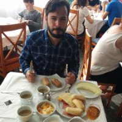

 Germán Molina Carrasco
===========================================

----

> Fallen in love of Software Development, I use Python as a spear and TDD as a shield. A program without tests is only
> 20% completed.

----

Personal data
---------
E-mail
: gmc.ykw@gmail.com

Phone number
: +34 649 84 82 57

Birth date
: 7 de noviembre de 1983

Languages
---------
Spanish
→   Native

English
→   Speaking: Medium-High | 
    Writing: High |
    Reading: High

Education
---------
2009-2013
:   *Technical engineering in computer systems*   
    Universidad de Informática de Murcia. 
	Intensifications: Networks y multimedia technologies.

2018-2019
:   *Cybersecurity postgrade*   
    Universidad Internacional de Valencia. 
	With honors: Data driven security.

Certifications
--------------
2017
:	*Blockchain for Busines*
    LinuxFundationX (edX)  
	Introduction to Hyperledge technologies 
 

Grants
-----------------------

2014
:	*Telefónica Startups Grant*
    Top 10 innovative ideas
    Project: Right ways - Sustainable tourism.
    Android app and backend based on python.  
    Universidad Politécnica de Cartagena.

Experience
-----------
**2015 - Currently
:	*Architect - Coordinator - Developer - DevOps***  
	[HOPU](https://hopu.eu/)  
	Startup focus on the use of IoT technologies for Smart Cities.
	All the technology is base in open standards like FIWARE and LwM2M integrated through Python backend services.

**2014 - 2014 (4 months)
:	*Architect - Developer***  
	**Tennis ACE**  
    Android application whose purpose was to measure the speed of tennis serves.
    Development of the mobile application, testing and study of equations.

**2014 - 2014 (1 month)
:	*Developer*  
	Caracool**  
	New Php module for private enterprise ERP.
	
	
**2013 - 2013 (1 month)
:	*Developer*  
	Caracool**  
	Bug fixing and development of a new module for a private enterprise ERP.
	

**2012 - 2012 (5 months)
:	*Developer*    
	Math department of the university of Mucia.**  
	Study and automatization of analisis of temporal series for stock markets.	
	
**2005 - 2007 (1 year y 4 months)
:   *Technician*  
    Inhis 2000**  
    Technical assistance for companies.

Some projects to highlight 💪:muscle:
----------------

**2021-Currently
:	HOPU**  
	Analysis & design of the application "Capacity management and crowd monitoring La Manga 365"

**2021-Currently
:	HOPU**  
	[https://www.i3-market.eu/](https://www.i3-market.eu/)  
    Pilots integration for i3-Market EU Project

**2021-Currently
:	HOPU**   
	[ODALA-PROJECT](https://oascities.org/odala-developing-the-future-of-smart-cities-communities/)     
    Environmental use case integration for ODALA EU Project.

**2020-2021
:	HOPU**  
    Analysis & design of the application "Efficient noise management for city of Valencia"

**2017-2020
:	HOPU - FORTIKA**  
    [https://fortika-project.eu/](https://fortika-project.eu/)  
	Development of IoT modules responsible of the deployment and management of cybersecurity services in remote IoT devices.

**2019-2019
:	HOPU - SerIoT**  
	[https://seriot-project.eu/](https://seriot-project.eu/)  
	Development of blockchain alert servives for IoT devices.

**2019-2019
:	HOPU - La Palma**  
	[https://lapalma-visualizer.hopu.eu/](https://lapalma-visualizer.hopu.eu/)  
	Framework to automatize the deploiment of smart city platforms based on FIWARE services.  	
  	

IT Skills
--------------
**OS:** GNU/Linux

**Languages:** Python, JavaScript, Java, HTML

**IoT:** LwM2M, MQTT, NGSI 9/10

**Deploy:**	Docker, Ansible, Gitlab CI/CD

**Platforms:** FIWARE

Other interests
---------------
Travel, Sport, Smart Cities, Open source software.
